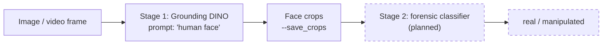
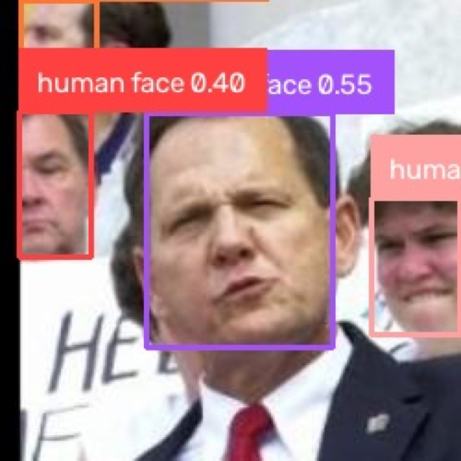
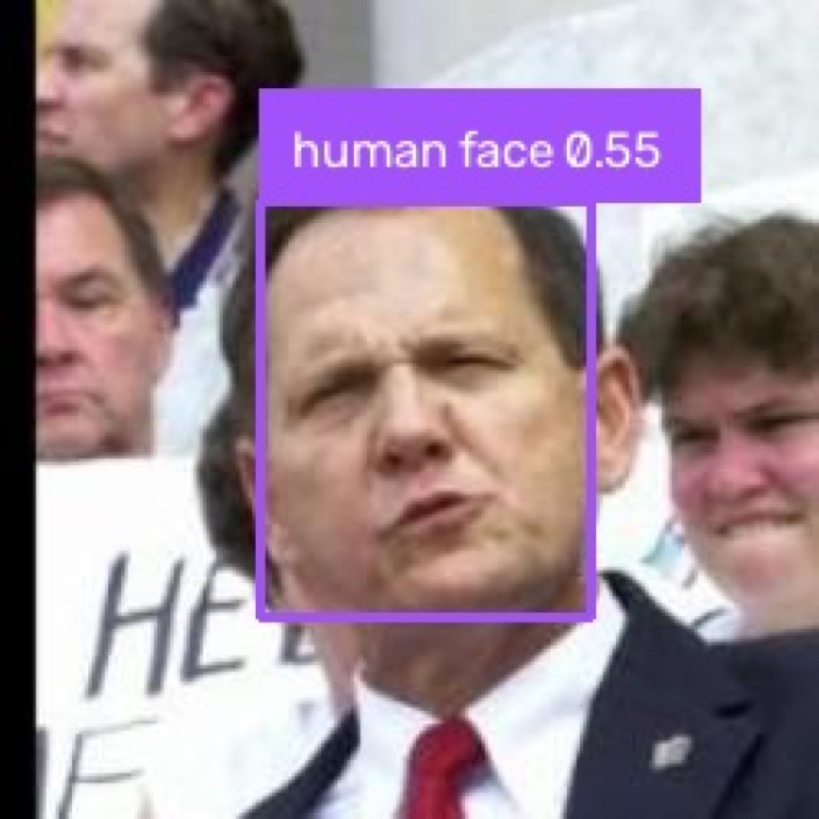
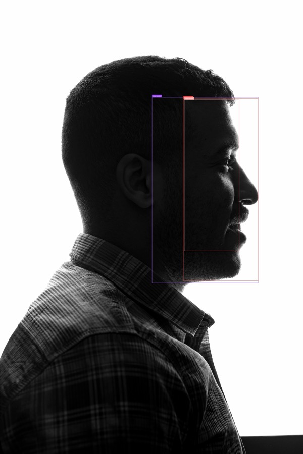
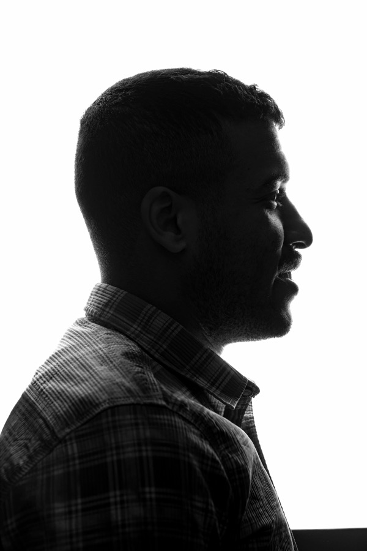

# Grounding DINO as a Face Localizer for Deepfake Detection

Can an open-vocabulary detector find faces well enough to be **stage 1** of a deepfake-detection pipeline, handing crops to a dedicated forensic model? This repo evaluates [Grounding DINO](https://github.com/IDEA-Research/GroundingDINO) (Swin-T) on 45 images across six conditions, sweeps its detection thresholds, and packages the detector as a reusable module for the next stage.

Research internship project, SKKU InfoLab (AI for Social Good Lab), Jul–Aug 2026, supervised by Prof. Tamer Abuhmed.



## Key findings

| | Finding |
|---|---|
| ✅ | **Frontal, profile, and moderately occluded faces are found reliably** with the prompt `"human face"`, typically one box per face at default thresholds. |
| ⚠️ | **No single threshold works everywhere.** Raising box/text thresholds removes duplicate boxes on easy frontal faces but drops harder profile faces entirely (below). The default 0.35 / 0.25 is a reasonable middle ground. |
| ❌ | **Dense crowds fail, and thresholds can't fix it.** A crowd photo with ~30–40 px faces returned **0 detections** on 4 of 5 prompts; even the most permissive setting (0.25 / 0.20) recovered only 2 low-confidence boxes out of hundreds of faces. This is a resolution/scale limitation, not a tuning one. |
| ❌ | **Prompt wording is not a forensic signal.** `"real face"` and `"manipulated face"` return nearly the same boxes as `"human face"` (avg 1.25 vs 1.17 vs 1.33 boxes/image on the deepfake sample). The model matches *face*, not *authenticity*, which supports using it only for localization. |

<table>
<tr>
<th>Duplicates at box 0.25 / text 0.20</th>
<th>Collapses to 1 box at 0.45 / 0.30</th>
<th>Profile face: 3 boxes at 0.25 / 0.20</th>
<th>…missed entirely at 0.45 / 0.30</th>
</tr>
<tr>
<td></td>
<td></td>
<td></td>
<td></td>
</tr>
</table>

Full write-ups: [Findings Report v2](reports/GroundingDINO_Report_v2.pdf) · [Initial Findings Report](reports/GroundingDINOInitialFindingsReport.pdf) · [Slides v2](reports/GroundingDINOInitialFindingsPresentation_v2.pdf) · [Initial slides](reports/GroundingDINOInitialFindingsPresentation.pdf) · [Model summary](docs/grounding_dino_summary.md)

## Quickstart

```bash
git clone https://github.com/Jamescorino8/deepfake-face-localization.git
cd deepfake-face-localization

conda create -n groundingdino python=3.10 -y
conda activate groundingdino

pip install torch torchvision          # pick the right build for your machine at pytorch.org
pip install -r requirements.txt
pip install -e GroundingDINO --no-build-isolation   # plain `pip install -e` fails: torch not visible in pip's isolated build env

mkdir -p weights
curl -L -o weights/groundingdino_swint_ogc.pth \
  https://github.com/IDEA-Research/GroundingDINO/releases/download/v0.1.0-alpha/groundingdino_swint_ogc.pth

# Smoke test (~5 s/image on an M2 CPU)
python src/batch_inference.py --input_folder data/single --output_folder results/smoke_test --prompt "human face"
```

Tested on macOS 26.6 / Apple M2, Python 3.10, PyTorch 2.13.0, transformers 4.37, CPU inference. Setup errors and their fixes are documented in [logs/Day02](logs/Day02/log.md) and [logs/Day04](logs/Day04/log.md).

## Usage

### Batch inference

```bash
python src/batch_inference.py \
  --input_folder data \
  --output_folder results/prompt_human_face \
  --prompt "human face" \
  --box_threshold 0.35 --text_threshold 0.25 \
  [--device auto|cpu|cuda|mps] [--save_crops] [--exclude PATTERN ...] [--overwrite]
```

The input folder is scanned recursively, and the subfolder name becomes each image's `category`. `subsets_for_thresholds/` and `test_*/` are skipped by default because they contain copies of other images. `--device auto` picks CUDA when available and otherwise CPU; MPS is opt-in because Grounding DINO has known MPS op gaps.

Each run writes:

| File | Contents |
|---|---|
| `predictions.json` | One entry per image: `image`, `category`, `prompt`, thresholds, `num_boxes`, `boxes` (normalized cx,cy,w,h), `boxes_xyxy` (pixels), `phrases`, `scores`, `inference_time_sec`, `image_width`, `image_height` |
| `detections.csv` | One row per detection with pixel coordinates (images with no detections get one empty row), for pandas/Excel |
| `run_config.json` | Exact command, all arguments, device, library versions, git commit, and timestamp, so every result folder is reproducible |
| `images/<category>/…` | Annotated images |
| `crops/<category>/…` | With `--save_crops`: each detected region with 20% padding (`--crop_pad`), ready for a stage-2 classifier |

### Threshold sweep

```bash
python src/threshold_sweep.py --input_folder data/occluded --prompt "human face" \
  --pairs 0.25:0.20 0.35:0.25 0.45:0.30 --output_prefix results/thresh_occluded
```

This loads the model once, runs each box:text pair into `results/thresh_occluded_box025_text020/` and so on, and writes a combined `results/thresh_occluded_summary.csv`.

### Using the detector from your own code

```python
from src.detector import GroundingDinoDetector, crop

det = GroundingDinoDetector(device="auto")
result, image_rgb, _ = det.detect("data/single/lfw_00.jpg", "human face")
faces = [crop(image_rgb, d.box_xyxy, pad=0.25) for d in result.detections]
```

### Other scripts

| Script | Purpose |
|---|---|
| `src/summarize_results.py` | Box counts grouped by category × prompt across `results/prompt_*` |
| `src/compare_thresholds.py` | Side-by-side box counts and scores across `results/thresh_*` |
| `src/make_small_lowres.py` | Regenerates `data/small_lowres/` by downscaling curated images to 40–90 px |

## Test set

| Category | Folder | Images | Source |
|---|---|---|---|
| Single frontal face | `data/single/` | 10 | [LFW](https://huggingface.co/datasets/logasja/lfw) via Hugging Face |
| Profile / angled | `data/profile/` | 5 | Pexels |
| Multiple faces | `data/multiple/` | 5 | Unsplash, including a dense crowd |
| Occluded | `data/occluded/` | 7 | Unsplash / Pexels: masks, hands, hair, sunglasses |
| Small / low-res | `data/small_lowres/` | 6 | Derived: `src/make_small_lowres.py` |
| Deepfake (placeholder) | `data/deepfake/` | 12 | [Kaggle: deepfake-and-real-images](https://www.kaggle.com/datasets/manjilkarki/deepfake-and-real-images), Test/Fake split; derived from [OpenForensics](https://zenodo.org/records/5528418) (Le et al., 2021, CC BY 4.0) |

The deepfake category is a stand-in until access to FaceForensics++, RWDF-23, or FakeAVCeleb is granted. It is not forensic-quality data, so treat any prompt results on it as exploratory.

## Repository layout

```
├── src/
│   ├── detector.py            # GroundingDinoDetector: model loading, device, box conversion, cropping
│   ├── batch_inference.py     # folder → annotated images + JSON/CSV + run config
│   ├── threshold_sweep.py     # multiple threshold pairs, one model load
│   └── ...                    # summarize / compare / data-generation helpers
├── data/                      # test images by category
├── results/                   # one folder per run (predictions + config; annotated images are gitignored)
├── reports/                   # findings reports, slides, weekly progress
├── docs/                      # model summary, README figures
├── logs/Day01 … Day14/        # daily research log: tasks, commands, errors & fixes
└── GroundingDINO/             # vendored upstream repo (Apache-2.0)
```

## Limitations

These results come from a 45-image test set and are measured by **box counts and confidence scores, not ground-truth annotations**. Terms like "missed" and "duplicate" come from visual inspection rather than a precision/recall calculation, and they should be read that way.

## Roadmap

Planned next steps, roughly in order:

1. **Ground-truth evaluation.** Annotate face boxes (or use a labeled set such as WIDER FACE val) and report precision, recall, and AP per category, replacing box counts.
2. **Duplicate suppression.** Add class-agnostic NMS after `predict()` in `detector.py` and re-run the sweep to see whether it removes the need for high thresholds.
3. **Dense-crowd recovery.** Try tiled / sliced inference (SAHI-style) or higher input resolution on the crowd image that currently gets 0 detections.
4. **Stage 2.** Feed `--save_crops` output to a pretrained deepfake classifier and measure end-to-end accuracy on real manipulated data once dataset access lands.
5. **Video.** Extend to frame sampling from FaceForensics++ / FakeAVCeleb videos.

## Acknowledgments

Grounding DINO is by IDEA Research; the vendored copy in `GroundingDINO/` keeps its original Apache-2.0 license.

```bibtex
@article{liu2023grounding,
  title   = {Grounding DINO: Marrying DINO with Grounded Pre-Training for Open-Set Object Detection},
  author  = {Liu, Shilong and Zeng, Zhaoyang and Ren, Tianhe and Li, Feng and Zhang, Hao and Yang, Jie and Li, Chunyuan and Yang, Jianwei and Su, Hang and Zhu, Jun and others},
  journal = {arXiv preprint arXiv:2303.05499},
  year    = {2023}
}
```
